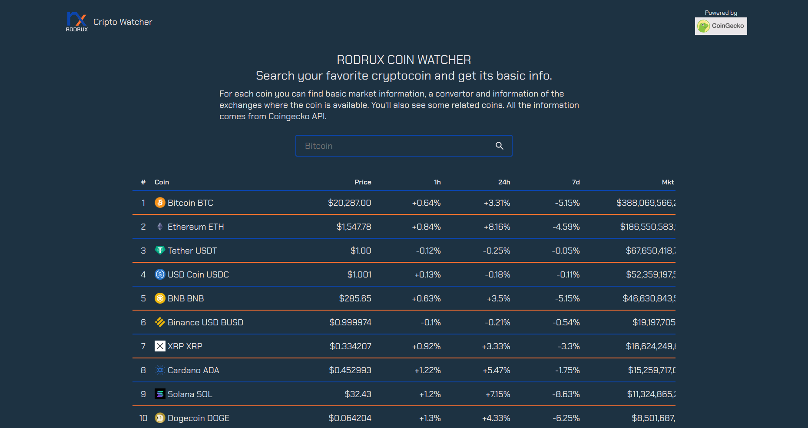

# Rodrux Coin Watcher

A web app to see cryptocurrencies and tokens information. The page brings the information from Coingecko's API. The user can search coins by title and see the coin's information, a coin convertor and some related coins to look after.

## Features

- Show a table of cryptocurrencies.
- Search cryptocurrencies and tokens by name.
- A currency convertor to fiat and other crypto.
- Show basic information for a cryptocurrencies or a token.
- Show related cryptos and tokens according to category.

## Installation

1. Clone or download the repository.
2. Install all the dependencies with `npm install`.
3. Run the project with `npm run start`.
4. Go to your browser to [http://localhost:3000/](http://localhost:3000/)

## **Built with**

Technologies used in the project:

- JavaScript
- React.js
- Redux
- Webpack
- Jest
- Testing Library
- CSS3 - HTML5

## Resources

Some useful resources used in the project are:

- [Coingecko API](https://www.coingecko.com/en/api/documentation)
- [React Icons](https://react-icons.github.io/react-icons/)
- [Curso Profesional de React.js y Redux](https://platzi.com/cursos/react-redux-profesional/)

## License

> This project is licensed under the MIT License
> 

## **Author**

Made with 💚 by [rodruxdev](https://twitter.com/rodruxdev)